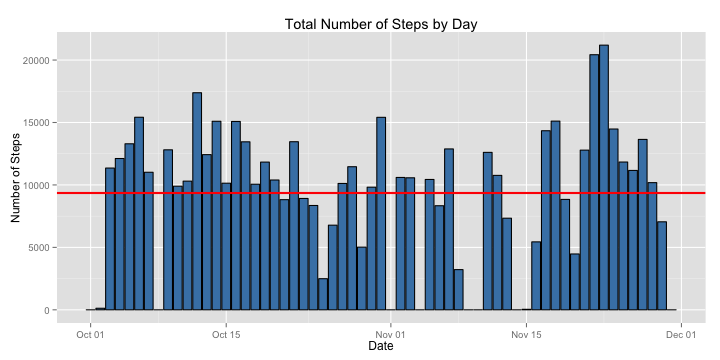
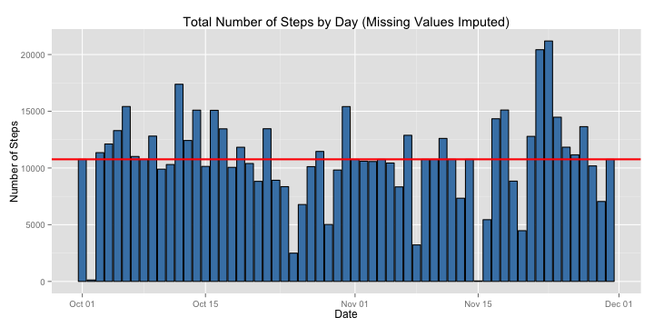

# Reproducible Research: Peer Assessment 1 Report
*Prepared By: Kuan Siew Weng*  
*Prepared On: 12th March 2015*

<br>
## Introduction
This is the analysis report for Coursera Data Science Specialization - 
Reproducible Research Peer Assessment 1.

<br>
## Dataset Description
The dataset for analysis consists of two months of data from an anonymous 
individual collected, using a personal activity monitoring device during the 
months of October and November 2012, and includes the number of steps taken in 
5-minute intervals each day.

The dataset is a comma-separated-value (CSV) file, and its variables are:
- steps: Number of steps taking in a 5-minute interval (missing values are coded as NA)
- date: The date on which the measurement was taken in YYYY-MM-DD format
- interval: Identifier for the 5-minute interval in which measurement was taken  

The dataset for this assignment was downloaded from the course web site URL: 
    https://d396qusza40orc.cloudfront.net/repdata%2Fdata%2Factivity.zip.

It is then unzipped and stored into the current working directory for this assignment.

<br>
## Loading and preprocessing the data

First, let's load the dataset file "activity.csv" from the current working directory
using the function read.csv() and check the column names as well as the initial rows.

```r
a <- read.csv("activity.csv")
str(a)
```

```
## 'data.frame':	17568 obs. of  3 variables:
##  $ steps   : int  NA NA NA NA NA NA NA NA NA NA ...
##  $ date    : Factor w/ 61 levels "2012-10-01","2012-10-02",..: 1 1 1 1 1 1 1 1 1 1 ...
##  $ interval: int  0 5 10 15 20 25 30 35 40 45 ...
```

```r
head(a)
```

```
##   steps       date interval
## 1    NA 2012-10-01        0
## 2    NA 2012-10-01        5
## 3    NA 2012-10-01       10
## 4    NA 2012-10-01       15
## 5    NA 2012-10-01       20
## 6    NA 2012-10-01       25
```

<br>
Let's check what the unique values for dates and interval variables are.  

```r
unique(a$date)
```

```
##  [1] 2012-10-01 2012-10-02 2012-10-03 2012-10-04 2012-10-05 2012-10-06
##  [7] 2012-10-07 2012-10-08 2012-10-09 2012-10-10 2012-10-11 2012-10-12
## [13] 2012-10-13 2012-10-14 2012-10-15 2012-10-16 2012-10-17 2012-10-18
## [19] 2012-10-19 2012-10-20 2012-10-21 2012-10-22 2012-10-23 2012-10-24
## [25] 2012-10-25 2012-10-26 2012-10-27 2012-10-28 2012-10-29 2012-10-30
## [31] 2012-10-31 2012-11-01 2012-11-02 2012-11-03 2012-11-04 2012-11-05
## [37] 2012-11-06 2012-11-07 2012-11-08 2012-11-09 2012-11-10 2012-11-11
## [43] 2012-11-12 2012-11-13 2012-11-14 2012-11-15 2012-11-16 2012-11-17
## [49] 2012-11-18 2012-11-19 2012-11-20 2012-11-21 2012-11-22 2012-11-23
## [55] 2012-11-24 2012-11-25 2012-11-26 2012-11-27 2012-11-28 2012-11-29
## [61] 2012-11-30
## 61 Levels: 2012-10-01 2012-10-02 2012-10-03 2012-10-04 ... 2012-11-30
```

```r
unique(a$interval)
```

```
##   [1]    0    5   10   15   20   25   30   35   40   45   50   55  100  105
##  [15]  110  115  120  125  130  135  140  145  150  155  200  205  210  215
##  [29]  220  225  230  235  240  245  250  255  300  305  310  315  320  325
##  [43]  330  335  340  345  350  355  400  405  410  415  420  425  430  435
##  [57]  440  445  450  455  500  505  510  515  520  525  530  535  540  545
##  [71]  550  555  600  605  610  615  620  625  630  635  640  645  650  655
##  [85]  700  705  710  715  720  725  730  735  740  745  750  755  800  805
##  [99]  810  815  820  825  830  835  840  845  850  855  900  905  910  915
## [113]  920  925  930  935  940  945  950  955 1000 1005 1010 1015 1020 1025
## [127] 1030 1035 1040 1045 1050 1055 1100 1105 1110 1115 1120 1125 1130 1135
## [141] 1140 1145 1150 1155 1200 1205 1210 1215 1220 1225 1230 1235 1240 1245
## [155] 1250 1255 1300 1305 1310 1315 1320 1325 1330 1335 1340 1345 1350 1355
## [169] 1400 1405 1410 1415 1420 1425 1430 1435 1440 1445 1450 1455 1500 1505
## [183] 1510 1515 1520 1525 1530 1535 1540 1545 1550 1555 1600 1605 1610 1615
## [197] 1620 1625 1630 1635 1640 1645 1650 1655 1700 1705 1710 1715 1720 1725
## [211] 1730 1735 1740 1745 1750 1755 1800 1805 1810 1815 1820 1825 1830 1835
## [225] 1840 1845 1850 1855 1900 1905 1910 1915 1920 1925 1930 1935 1940 1945
## [239] 1950 1955 2000 2005 2010 2015 2020 2025 2030 2035 2040 2045 2050 2055
## [253] 2100 2105 2110 2115 2120 2125 2130 2135 2140 2145 2150 2155 2200 2205
## [267] 2210 2215 2220 2225 2230 2235 2240 2245 2250 2255 2300 2305 2310 2315
## [281] 2320 2325 2330 2335 2340 2345 2350 2355
```

<br>
The possible values for the interval variable appears to be a time value in the 24-hour format.
Let's pad the interval values with leading zeros to make the values more user-readable in the 24-hour time-format.  

For data transformation, the date and interval variables are type-converted to Date and factor respectively.  

```r
library(stringr)
a$date <- as.Date(a$date)
a$interval <- factor(str_pad(a$interval, 4, pad = "0"))
```

<br>
Here are the values of date and interval variables after padding and type conversion.

```r
str(a)
```

```
## 'data.frame':	17568 obs. of  3 variables:
##  $ steps   : int  NA NA NA NA NA NA NA NA NA NA ...
##  $ date    : Date, format: "2012-10-01" "2012-10-01" ...
##  $ interval: Factor w/ 288 levels "0000","0005",..: 1 2 3 4 5 6 7 8 9 10 ...
```

```r
unique(a$date)
```

```
##  [1] "2012-10-01" "2012-10-02" "2012-10-03" "2012-10-04" "2012-10-05"
##  [6] "2012-10-06" "2012-10-07" "2012-10-08" "2012-10-09" "2012-10-10"
## [11] "2012-10-11" "2012-10-12" "2012-10-13" "2012-10-14" "2012-10-15"
## [16] "2012-10-16" "2012-10-17" "2012-10-18" "2012-10-19" "2012-10-20"
## [21] "2012-10-21" "2012-10-22" "2012-10-23" "2012-10-24" "2012-10-25"
## [26] "2012-10-26" "2012-10-27" "2012-10-28" "2012-10-29" "2012-10-30"
## [31] "2012-10-31" "2012-11-01" "2012-11-02" "2012-11-03" "2012-11-04"
## [36] "2012-11-05" "2012-11-06" "2012-11-07" "2012-11-08" "2012-11-09"
## [41] "2012-11-10" "2012-11-11" "2012-11-12" "2012-11-13" "2012-11-14"
## [46] "2012-11-15" "2012-11-16" "2012-11-17" "2012-11-18" "2012-11-19"
## [51] "2012-11-20" "2012-11-21" "2012-11-22" "2012-11-23" "2012-11-24"
## [56] "2012-11-25" "2012-11-26" "2012-11-27" "2012-11-28" "2012-11-29"
## [61] "2012-11-30"
```

```r
unique(a$interval)
```

```
##   [1] 0000 0005 0010 0015 0020 0025 0030 0035 0040 0045 0050 0055 0100 0105
##  [15] 0110 0115 0120 0125 0130 0135 0140 0145 0150 0155 0200 0205 0210 0215
##  [29] 0220 0225 0230 0235 0240 0245 0250 0255 0300 0305 0310 0315 0320 0325
##  [43] 0330 0335 0340 0345 0350 0355 0400 0405 0410 0415 0420 0425 0430 0435
##  [57] 0440 0445 0450 0455 0500 0505 0510 0515 0520 0525 0530 0535 0540 0545
##  [71] 0550 0555 0600 0605 0610 0615 0620 0625 0630 0635 0640 0645 0650 0655
##  [85] 0700 0705 0710 0715 0720 0725 0730 0735 0740 0745 0750 0755 0800 0805
##  [99] 0810 0815 0820 0825 0830 0835 0840 0845 0850 0855 0900 0905 0910 0915
## [113] 0920 0925 0930 0935 0940 0945 0950 0955 1000 1005 1010 1015 1020 1025
## [127] 1030 1035 1040 1045 1050 1055 1100 1105 1110 1115 1120 1125 1130 1135
## [141] 1140 1145 1150 1155 1200 1205 1210 1215 1220 1225 1230 1235 1240 1245
## [155] 1250 1255 1300 1305 1310 1315 1320 1325 1330 1335 1340 1345 1350 1355
## [169] 1400 1405 1410 1415 1420 1425 1430 1435 1440 1445 1450 1455 1500 1505
## [183] 1510 1515 1520 1525 1530 1535 1540 1545 1550 1555 1600 1605 1610 1615
## [197] 1620 1625 1630 1635 1640 1645 1650 1655 1700 1705 1710 1715 1720 1725
## [211] 1730 1735 1740 1745 1750 1755 1800 1805 1810 1815 1820 1825 1830 1835
## [225] 1840 1845 1850 1855 1900 1905 1910 1915 1920 1925 1930 1935 1940 1945
## [239] 1950 1955 2000 2005 2010 2015 2020 2025 2030 2035 2040 2045 2050 2055
## [253] 2100 2105 2110 2115 2120 2125 2130 2135 2140 2145 2150 2155 2200 2205
## [267] 2210 2215 2220 2225 2230 2235 2240 2245 2250 2255 2300 2305 2310 2315
## [281] 2320 2325 2330 2335 2340 2345 2350 2355
## 288 Levels: 0000 0005 0010 0015 0020 0025 0030 0035 0040 0045 0050 ... 2355
```

<br>
## What is mean total number of steps taken per day?

Ignoring the missing values, the total number of steps taken per day is calculated by using the group_by() and summarize() functions of the dplyr package, as follows:

```r
library(dplyr)
a1 <- summarize(group_by(a, date), 
                tot.steps = sum(steps, na.rm = TRUE))
data.frame(a1)
```

```
##          date tot.steps
## 1  2012-10-01         0
## 2  2012-10-02       126
## 3  2012-10-03     11352
## 4  2012-10-04     12116
## 5  2012-10-05     13294
## 6  2012-10-06     15420
## 7  2012-10-07     11015
## 8  2012-10-08         0
## 9  2012-10-09     12811
## 10 2012-10-10      9900
## 11 2012-10-11     10304
## 12 2012-10-12     17382
## 13 2012-10-13     12426
## 14 2012-10-14     15098
## 15 2012-10-15     10139
## 16 2012-10-16     15084
## 17 2012-10-17     13452
## 18 2012-10-18     10056
## 19 2012-10-19     11829
## 20 2012-10-20     10395
## 21 2012-10-21      8821
## 22 2012-10-22     13460
## 23 2012-10-23      8918
## 24 2012-10-24      8355
## 25 2012-10-25      2492
## 26 2012-10-26      6778
## 27 2012-10-27     10119
## 28 2012-10-28     11458
## 29 2012-10-29      5018
## 30 2012-10-30      9819
## 31 2012-10-31     15414
## 32 2012-11-01         0
## 33 2012-11-02     10600
## 34 2012-11-03     10571
## 35 2012-11-04         0
## 36 2012-11-05     10439
## 37 2012-11-06      8334
## 38 2012-11-07     12883
## 39 2012-11-08      3219
## 40 2012-11-09         0
## 41 2012-11-10         0
## 42 2012-11-11     12608
## 43 2012-11-12     10765
## 44 2012-11-13      7336
## 45 2012-11-14         0
## 46 2012-11-15        41
## 47 2012-11-16      5441
## 48 2012-11-17     14339
## 49 2012-11-18     15110
## 50 2012-11-19      8841
## 51 2012-11-20      4472
## 52 2012-11-21     12787
## 53 2012-11-22     20427
## 54 2012-11-23     21194
## 55 2012-11-24     14478
## 56 2012-11-25     11834
## 57 2012-11-26     11162
## 58 2012-11-27     13646
## 59 2012-11-28     10183
## 60 2012-11-29      7047
## 61 2012-11-30         0
```

<br>
Here is a histogram plot of the total number of steps taken per day using the ggplot2 plotting system,   
with the mean value indicated by the red horizontal line. 

```r
library(ggplot2)

ggplot(a1,aes(x = date, y = tot.steps)) + 
    geom_bar(stat = "identity", fill = "steelblue", color = "black") +
    geom_hline(yintercept = mean(a1$tot.steps), color = "red", size = 1) +
    labs(list(title = "Total Number of Steps by Day",
              y = "Number of Steps",x="Date"))
```

 

<br>
Here, the mean and median of the total number of steps taken per day is calculated.

```r
mean(a1$tot.steps)
```

```
## [1] 9354.23
```

```r
median(a1$tot.steps)
```

```
## [1] 10395
```

<br>
## What is the average daily activity pattern?
Before summarizing the data and plotting the graph, I will first transform the interval variable values (in 24-hour format) to a new continuous integer variable called intvl.mins, which stores the start time of the interval in minutes from the start of day.  This is to ensure that the adjacent interval values such as 0055 and 0100 are correctly positioned on the x-axis of the time-series line plot.

The interval variable is transformed to the new continuous integer variable, intvl.mins, as follows:

```r
a$intvl.mins <- ((as.numeric(substr(a$interval,1,2))*60 ) + 
                 (as.numeric(substr(a$interval,3,4))))
```

<br>
Ignoring missing values, now we can calculate the average number of steps taken for each 5 minute interval, 
averaged across all days, using the group_by() and summarize() functions of the dplyr package.

```r
a2 <- summarize(group_by(a,intvl.mins), 
                avg.steps = round(mean(steps, na.rm=TRUE), digits = 3))
```

<br>
Here is the time-series line plot of the average number of steps taken at each 5 minute interval of the day, averaged across all days, created using the ggplot2 plotting system.   This R chunk includes a x-tick label formatter which is used to pretty-print the new intvl.mins variable in the 24-hour time format on the x-axis.

```r
timeHMS_formatter <- function(x) {
    h <- floor(x / 60)
    m <- floor(x %% 60)
    lab <- sprintf('%02d:%02d',h,m)    
}

ggplot(a2, aes(x = intvl.mins, y = avg.steps)) + geom_line() + 
    scale_x_continuous(label = timeHMS_formatter, 
                       limits = c(0,1435), 
                       breaks = c(0,120,240,360,480,600,720,840,960,1080,1200,1320,1440)) +
    labs(list(
        title = "Number of Steps by Time of Day Averaged Across all Days",
        y = "Number of Steps",x="Time of Day"))
```

 

<br>
Using the following R chunk, the 5-min interval of the day that contains the highest average steps, averaged across all days, is identified to be the 08:35 time interval.

```r
print(timeHMS_formatter(as.numeric(a2[which.max(a2$avg.steps),"intvl.mins"])))
```

```
## [1] "08:35"
```


<br>
## Imputing missing values
In this R chunk, we check for missing values in the raw dataset, and found that the
value of the steps variable is missing in 2304 rows. 

```r
anyNA(a$date)
```

```
## [1] FALSE
```

```r
anyNA(a$interval)
```

```
## [1] FALSE
```

```r
anyNA(a$steps)
```

```
## [1] TRUE
```

```r
nrow(a[is.na(a$steps),])
```

```
## [1] 2304
```

```r
head(a)
```

```
##   steps       date interval intvl.mins
## 1    NA 2012-10-01     0000          0
## 2    NA 2012-10-01     0005          5
## 3    NA 2012-10-01     0010         10
## 4    NA 2012-10-01     0015         15
## 5    NA 2012-10-01     0020         20
## 6    NA 2012-10-01     0025         25
```

<br>
The strategy to fill the missing step value is to simply use the mean for the corresponding 5-minute interval which was calculated and stored in the data frame a2 in the earlier part of this assignment.   To achieve this value imputation strategy, a new dataset b is first created by joining the original data frame a and the data frame a2;  adding the avg.steps value for the 5-minute interval to each row of the original data frame.  

```r
b <- inner_join(a, a2)
```

```
## Joining by: "intvl.mins"
```

```r
head(b)
```

```
##   steps       date interval intvl.mins avg.steps
## 1    NA 2012-10-01     0000          0     1.717
## 2    NA 2012-10-01     0005          5     0.340
## 3    NA 2012-10-01     0010         10     0.132
## 4    NA 2012-10-01     0015         15     0.151
## 5    NA 2012-10-01     0020         20     0.075
## 6    NA 2012-10-01     0025         25     2.094
```

After the new dataset is created and the new column is added, the missing value in the steps variable for each observation can be replaced by the value of its avg.steps column as follows:

```r
b$steps <- ifelse(!is.na(b$steps), b$steps, round(b$avg.steps, digits = 0))
```

<br>
Let's double-check that there are no more rows with missing values after the above operation to impute missing values for the steps variable.  head(b) also shows that the missing values in the first 6 rows have been successfully imputed.

```r
anyNA(b$steps)
```

```
## [1] FALSE
```

```r
head(b)
```

```
##   steps       date interval intvl.mins avg.steps
## 1     2 2012-10-01     0000          0     1.717
## 2     0 2012-10-01     0005          5     0.340
## 3     0 2012-10-01     0010         10     0.132
## 4     0 2012-10-01     0015         15     0.151
## 5     0 2012-10-01     0020         20     0.075
## 6     2 2012-10-01     0025         25     2.094
```

<br>
Now that the missing values have been imputed, the total number of steps taken per day can be re-calculated by using the group_by() and summarize() functions of the dplyr package, as follows:

```r
b1 <- summarize(group_by(b, date), tot.steps = sum(steps, na.rm=TRUE))
data.frame(b1)
```

```
##          date tot.steps
## 1  2012-10-01     10762
## 2  2012-10-02       126
## 3  2012-10-03     11352
## 4  2012-10-04     12116
## 5  2012-10-05     13294
## 6  2012-10-06     15420
## 7  2012-10-07     11015
## 8  2012-10-08     10762
## 9  2012-10-09     12811
## 10 2012-10-10      9900
## 11 2012-10-11     10304
## 12 2012-10-12     17382
## 13 2012-10-13     12426
## 14 2012-10-14     15098
## 15 2012-10-15     10139
## 16 2012-10-16     15084
## 17 2012-10-17     13452
## 18 2012-10-18     10056
## 19 2012-10-19     11829
## 20 2012-10-20     10395
## 21 2012-10-21      8821
## 22 2012-10-22     13460
## 23 2012-10-23      8918
## 24 2012-10-24      8355
## 25 2012-10-25      2492
## 26 2012-10-26      6778
## 27 2012-10-27     10119
## 28 2012-10-28     11458
## 29 2012-10-29      5018
## 30 2012-10-30      9819
## 31 2012-10-31     15414
## 32 2012-11-01     10762
## 33 2012-11-02     10600
## 34 2012-11-03     10571
## 35 2012-11-04     10762
## 36 2012-11-05     10439
## 37 2012-11-06      8334
## 38 2012-11-07     12883
## 39 2012-11-08      3219
## 40 2012-11-09     10762
## 41 2012-11-10     10762
## 42 2012-11-11     12608
## 43 2012-11-12     10765
## 44 2012-11-13      7336
## 45 2012-11-14     10762
## 46 2012-11-15        41
## 47 2012-11-16      5441
## 48 2012-11-17     14339
## 49 2012-11-18     15110
## 50 2012-11-19      8841
## 51 2012-11-20      4472
## 52 2012-11-21     12787
## 53 2012-11-22     20427
## 54 2012-11-23     21194
## 55 2012-11-24     14478
## 56 2012-11-25     11834
## 57 2012-11-26     11162
## 58 2012-11-27     13646
## 59 2012-11-28     10183
## 60 2012-11-29      7047
## 61 2012-11-30     10762
```

<br>
Here the histogram of the total number of steps taken per day is re-plotted using the ggplot2 plotting system.  
Now, there are additional bars for those days which had missing values in their steps variable previously.

```r
ggplot(b1, aes(x = date, y = tot.steps)) + 
    geom_bar(stat = "identity", fill = "steelblue", color = "black") +
    geom_hline(yintercept = mean(b1$tot.steps), color = "red", size = 1) +
    labs(list(title = "Total Number of Steps by Day (Missing Values Imputed)",
              y = "Number of Steps",x = "Date"))
```

 
 

<br>
Here, the mean and median of the total number of steps taken per day is re-calculated.  It can be seen that both the mean and median values have increased after the missing values in the steps variable has been imputed.

```r
mean(b1$tot.steps)
```

```
## [1] 10765.64
```

```r
median(b1$tot.steps)
```

```
## [1] 10762
```


<br>
## Are there differences in activity patterns between weekdays and weekends?
To distinguish activity patterns between weekdays and weekends, a new variable wkend is added 
to the data frame.   The weekdays() function is used to determine if the date of an observation is a weekend or a weekday.  If date falls on a Saturday or Sunday, the value of this new variable is set to "Weekend".   Otherwise, it is set to "Weekday".   

```r
b$wkend <- (weekdays(b$date) %in% c("Sunday", "Saturday"))
b$wkend <- factor(b$wkend, levels = c("TRUE", "FALSE"), 
                  labels = c("Weekend","Weekday"))
```

<br>
Using the group_by() and summarize() functions of the dplyr package, the average number of steps taken 
for each 5 minute interval, averaged across all days and grouped by weekdays and weekends, can be
calculated using the new dataset which has imputed the missing values in the steps variable.

```r
b2 <- summarize(group_by(b, wkend, intvl.mins),
                avg.steps = mean(steps, na.rm=TRUE))
```

<br>
Finally, the multi-facet time-series plot of the 5-minute interval (x-axis) and the average number of steps taken, averaged across all weekday days or weekend days (y-axis) is generated based on the above processed dataset, using the ggplot2 plotting system.

```r
ggplot(b2, aes(x = intvl.mins, y = avg.steps)) + geom_line() + 
    scale_x_continuous(label = timeHMS_formatter, 
                       limits = c(0,1435), 
                       breaks = c(0,120,240,360,480,600,720,840,960,1080,1200,1320,1440)) +
    facet_grid(wkend ~ .) +
    labs(list(title = "Number of Steps by Time of Day Averaged Across WeekDays & Weekends",
        y = "Number of Steps",x = "Time of Day"))
```

 

<br>
Comparing the two time-series line graphs, it can be observed that the activity patterns of the individual is different on weekends as compared to weekdays.   He became active later in the morning of weekends as compared to weekdays, but he remained active throughout the day into the evenings on weekends, whereas on weekdays, he is comparatively less active during the afternoons and evenings.


<br>
****
